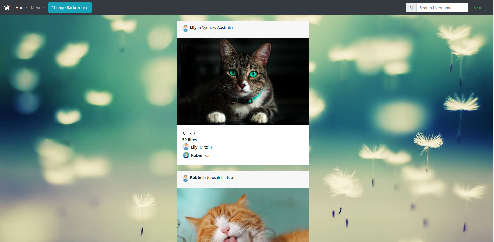

# InstagramWebApp

Simple Instagram clone for web

## Description
This is a simple Instagram clone that runs on a python server with JSON as its database.
The main features are:
- Like posts
- Comment on posts
- Upload new posts
- Search posts by user name

## Requirements
- Python 2.7

## Getting Started
To run the app, first run the server and then open the app on the browser:
`python server.py`

